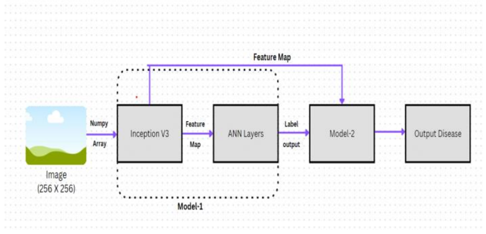

# Hierarchical-Multi-Class-Classification
The project's hierarchical approach addresses this problem by advocating for a tree-like architecture, where specialized models handle distinct subcategories within the broader classification.
## Architecture

    

